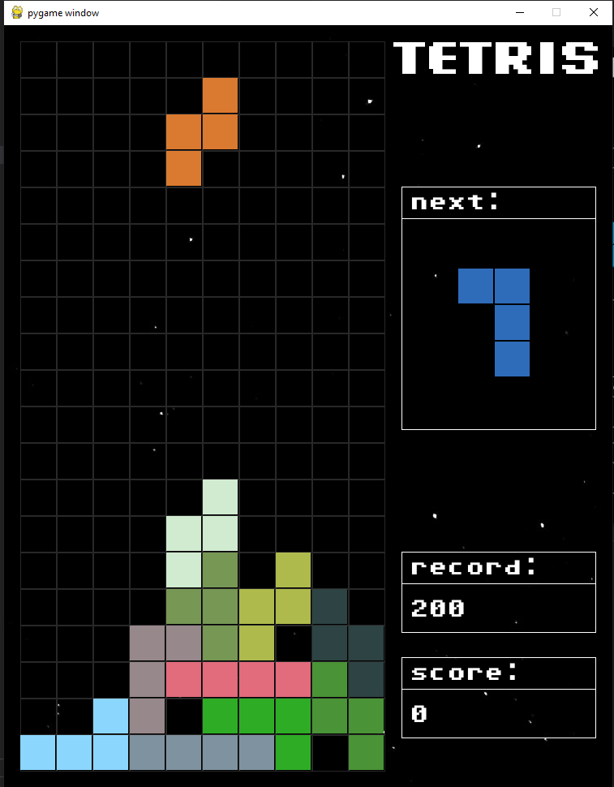

# python-tetris
tetris game built with python and pygame library.

<p align="center">
  
</p>

# Prerequisites
- [Python](https://www.python.org)
- [Pygame](https://www.pygame.org/wiki/GettingStarted)

# Set up
download & install python 3 from the official site.

run the following in the terminal to install pygame library: 
```bash
  pip3 install pygame
```

download the source code from the repository and run as a .py file.
```bash
  python3 main.py
```

# Controls
- left/right arrow keys --> move figure 
- up arrow key --> rotate figure
- down arrow key --> accelerate figure 
